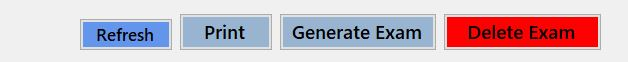
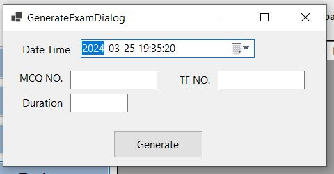
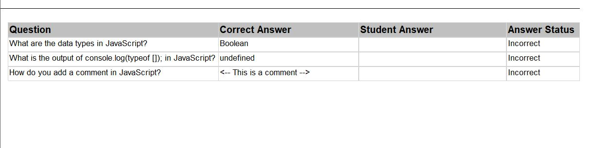

# Exam System Documentation for Instructors (AbdelRahman Ahmed And mohamed saber)
Welcome to the Exam System documentation for instructors. This system provides tools for managing questions, generating random exams, and generating reports. Below is a guide on how to use these features effectively.

## Table of Contents
1. [Adding Questions](#adding-questions)
2. [Generating Random Exams](#generating-random-exams)
3. [Reporting](#reporting)

## Adding Questions 

To add questions for different courses, follow these steps:

### Step 1: Access the Question Bank 

- Log in to your instructor account.
- Navigate to the "Questions" section.

### Step 2: Select Course

- Choose the course for which you want to add questions.

### Step 3: Add Questions

- Click on the "Add Question" button.
- Specify the type of question (e.g., multiple-choice, true/false, short answer).
- Enter the question and its answer choices (if applicable).
- Save the question.

### Step 4: Review and Edit
- Review the questions added to ensure correctness and clarity.
- Edit any questions if necessary.

### Step 5: Repeat for Other Courses
- Repeat the above steps for other courses as needed.

## Generating Random Exams 

The system allows you to generate random exams based on the questions available in the question bank. Here's how:

### Step 1: Navigate to Exam Generation

- Go to the "Exam Generation" section.

### Step 2: Select Course and Exam Details

- Choose the course for which you want to generate an exam.
- Specify the number of questions needed for the exam.
- Set any additional parameters (e.g., time limit).

### Step 3: Generate Exam
- Click on the "Generate Exam" button.
- The system will randomly select questions from the question bank based on your criteria and create the exam.

### Step 4: Review and Finalize
- Review the generated exam to ensure appropriateness.
- Make any necessary adjustments.
- Finalize and save the exam.

## Reporting 

The reporting feature allows you to track exam results and student performance. Here's how to access reports:

### first report is print freeform report

- Navigate to the "Exam" section.
- Select an Exam and Click print

### 2ed report is Student Exam Answers

- Enter the exam id and student id and click submit then print
- Select the specific exam for which you want to generate a report.

### 3rd report is Student numbers percourse this instructor teaches

- Select the specific course for which you want to generate a report.

### 4th report is course topic report

- Select Course from dropdown menu and click print

### Step 4: Analyze and Take Action
- Analyze the report data to identify trends and areas for improvement.
- Use the insights gained to adjust teaching strategies or modify future exams as needed.

 documentation or contact technical support.

Happy teaching and assessing! 🎓✨
